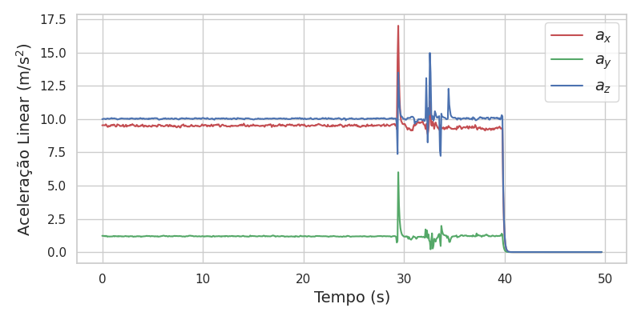
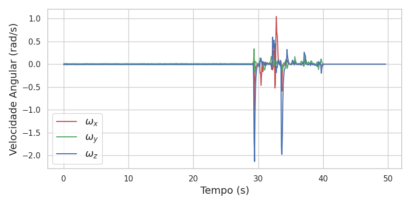

# esp32_imu

Este repositório contém o código para um sistema de medição inercial utilizando o sensor MPU6050 integrado ao ESP32, com transmissão de dados via Bluetooth. O sistema é capaz de capturar aceleração linear e velocidade angular em tempo real, e os dados podem ser processados no ROS2.

## Conexão com o ESP32 utilizando Ubuntu

Para conectar o ESP32 via Bluetooth, identifique o endereço MAC do dispositivo, que deve ser um código como `A0:A3:B3:89:25:A6`. Em seguida, execute o comando abaixo para associar o dispositivo a uma porta serial:

```sh
sudo rfcomm bind /dev/rfcomm0 A0:A3:B3:89:25:A6
```

## Dependências para utilizar a IMU

Instale a biblioteca MPU6050 no Arduino IDE ou no PlatformIO utilizando o link abaixo:

[MPU6050 Library](https://github.com/ElectronicCats/mpu6050)

## Resultados

O sistema desenvolvido foi testado e os dados de aceleração linear e velocidade angular foram capturados e visualizados, conforme mostrado nas figuras abaixo.

### Aceleração Linear



### Velocidade Angular



## Utilizando o ROS2

Para processar os dados no ROS2, basta utilizar o arquivo de lançamento `imu.launch.py`. Este arquivo realiza a configuração necessária para a leitura dos dados recebidos via Bluetooth.

Execute o comando abaixo para iniciar o sistema no ROS2:

```sh
ros2 launch esp32_imu imu.launch.py
```

Este comando configurará os nós necessários para a captura e processamento dos dados de IMU no ROS2.

## Licença

Este projeto está sob a licença MIT. Consulte o arquivo LICENSE para mais informações.

## Construção e Uso do Docker

Para facilitar o uso e a execução do pacote `esp32_imu` em diferentes ambientes, você pode criar uma imagem Docker que contém todas as dependências necessárias. 
Siga as instruções abaixo para construir e usar a imagem Docker (antes disso é necessário instalar o docker engine, 
[clique aqui para acessar o manual de instalação](https://docs.docker.com/engine/install/ubuntu/).):

### Passo 1: Construir a Imagem Docker

Certifique-se de que o arquivo `Dockerfile` esteja localizado no diretório `esp32_imu` dentro do seu workspace ROS2. Em seguida, abra um terminal e navegue até o diretório:

```sh
cd /home/mendes/Workspaces/imu_ws/src/esp32_imu
```

Para construir a imagem Docker, execute o comando:

```sh
docker build -t ros2-bluetooth-app .
```

Este comando criará uma imagem Docker chamada `ros2-bluetooth-app` com base no conteúdo do diretório atual.

### Passo 2: Executar o Container Docker

Após construir a imagem, você pode executá-la com o seguinte comando:

```sh
docker run --privileged --network host -v /home/mendes/Workspaces/imu_ws:/ros2_ws -it ros2-bluetooth-app
```

Este comando irá:

- Executar o container com permissões privilegiadas (`--privileged`) para permitir acesso ao hardware Bluetooth.
- Usar a rede do host (`--network host`), essencial para a comunicação Bluetooth.
- Montar o workspace local (`-v /home/mendes/Workspaces/imu_ws:/ros2_ws`) dentro do container, permitindo que o ROS2 reconheça e utilize todos os pacotes do workspace.

### Passo 3: Verificar o Funcionamento

Dentro do container, o ROS2 será iniciado automaticamente, e o pacote `esp32_imu` será lançado. Certifique-se de que o dispositivo Bluetooth esteja disponível e que o script `imu_publisher.py` esteja funcionando corretamente.

Caso precise parar o container, utilize `Ctrl + C`.

### Observações Adicionais

- Certifique-se de que o dispositivo ESP32 esteja emparelhado corretamente com o seu host antes de iniciar o container.
- Se necessário, libere a porta Bluetooth com o comando:

  ```sh
  sudo rfcomm release /dev/rfcomm0
  ```
